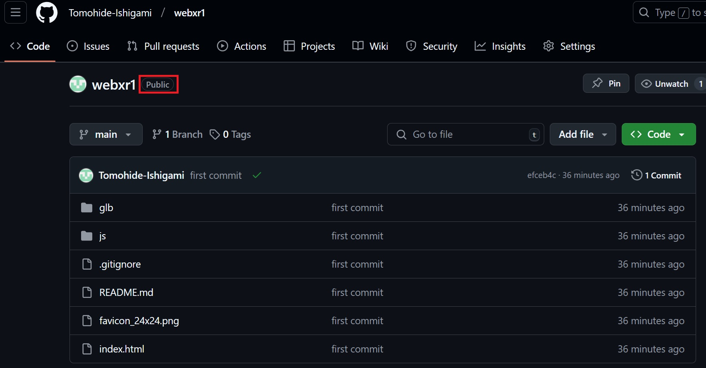
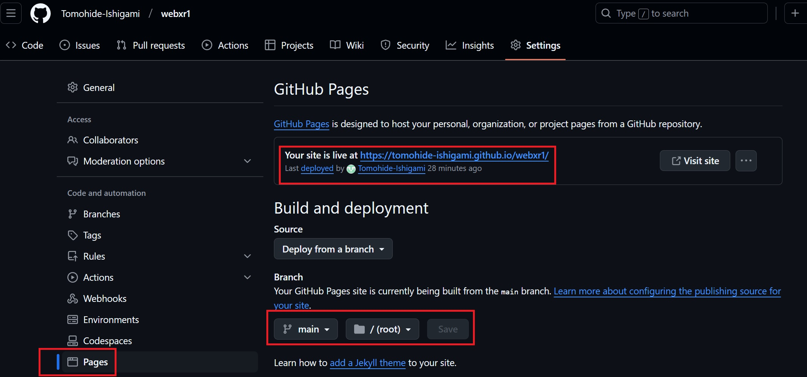

# Babylon3DViewTest
babylon.jsを用いた3D表示のテストコード

## 3. githubに格納しhttps通信でアクセス
  コード: https://github.com/Tomohide-Ishigami/webxr1  
    ↓  
　httpsアクセス: https://tomohide-ishigami.github.io/webxr1/index.html  
 ### 3.1 githubに格納しhttps通信でアクセス参考
 [GitHubでWebサーバー立ててみた話](https://note.com/straw_polarbear/n/nc14b503c654f)  
・上記サイトを参考に、個人/会社のgithubで一旦リポジトリを作成  
・リポジトリのtopにindex.htmlを作成  
・リポジトリをpublicで公開  
  
・githubのリポジトリ > Settings > Pagesへアクセスし、Sourseの「None」を「master branch」に変更  
  
・以下も参考に  
  [GitHub Pagesで404エラーが出たとき](https://zenn.dev/skal073/articles/6b00d731ab3cbf)  

## 4. Babylon.js 関連URL
  Babylon.js の公式ドキュメントやAPIリファレンス、チュートリアルなどのURLを以下に列挙
   - ドキュメント ホーム  
https://doc.babylonjs.com/
   - APIドキュメント  
https://doc.babylonjs.com/typedoc/modules/BABYLON
   - フォーラム  
https://forum.babylonjs.com/
   - 機能デモ  
https://www.babylonjs.com/featureDemos/
   - playground (コード付きデモ集)  
https://playground.babylonjs.com/
   - playgroundの検索  
https://doc.babylonjs.com/playground
   - 公式入門チュートリアルざっくり和訳（Microfost社員のちょまどさんが公開）  
https://zenn.dev/chomado/books/babylonjs-tutorial-ja 